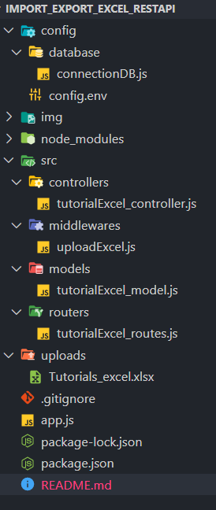

# 💻Upload/Download ExcelFile into MongoDB (NodeJS, ExpressJS, MongoDB) 😎👍

## ✔Intro

- We’re gonna create RestAPIs using (NodeJS, Express, MongoDB) Application that provides APIs for:

  - Uploading Excel File to the Node.js Express Server & storing data in MongoDB Database
  - Getting list of all items from MongoDB table
  - Downloading MongoDB table data as Excel file

  <b>NOTE</b>: Excel File Extension <b>.xlsx</b>

## ✔Project Structure



## ✔Project Setup

```
npm install
```

## ✔Database Config (MongoDB_URI)

- Put the MONGO_URI into <b>config/config.env</b>

## ✔Run Project

```
npm run dev
```

## ✔API Route


